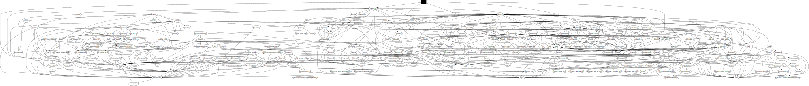

# warpsvc

Small [warp](https://crates.io/crates/warp) web service handler.

## Installation

Cargo:

```bash
cargo install --git https://github.com/hrbrmstr/mepower --branch batman
```

## Building (release)

Assuming you use [Just](https://github.com/casey/just):

```bash
git clone git@github.com:hrbrmstr/warpsvc && \
  cd warpsvc && \
  just release
```

## Dependencies

- [SBOM](bom.xml)

